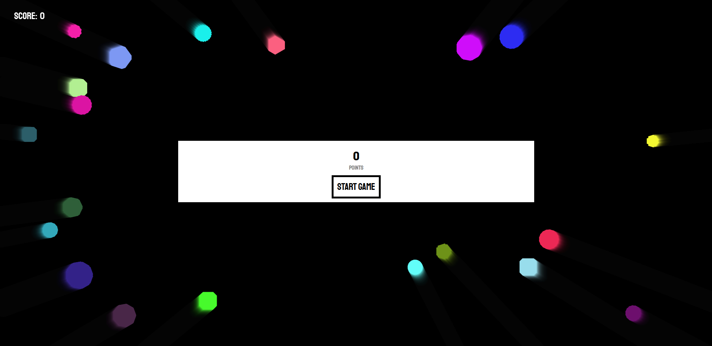
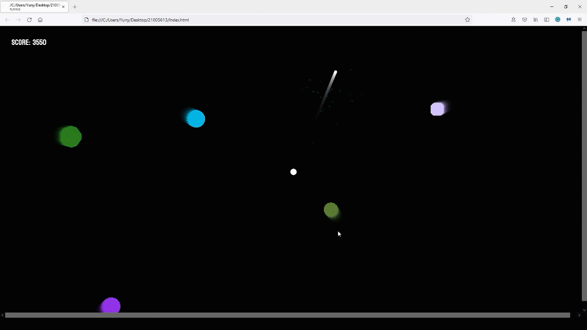

# Star wars!

Coding One Final Project
21005613 Yun Jung Jang 

## Introduction

This is a further development of the "Stars" mode of my week3 "Raindrop and stars" project. 

Visit my "Raindrop and stars" project: (https://mimicproject.com/code/5e1f4145-1598-4cb5-4ec2-faac463fa55f)

It is a functional project that generates different star shapes when its users click with the mouse button on the screen.
I made it to check easily how a system based on a random condition can create different shapes.

This time, I made a game with a similar code. This generates slightly different star shapes compare to the previous project. The user can start the game pressing the "Start Game" button.

At the beginning of the game, the white circle in the middle of the black screen represents the user.
When the user targets with the mouse a flying star and click it, the white circle shoots a projectile. If the target has a big shape, it will reduce its size and it will disappear at the end.
The goal is to destroy the incoming stars. The player will get a higher score when the star is completely destroyed compare to when a star reduces the size.
When a star hits the user, the game ends.
The user can check their score on the left-top corner of the screen and when they start and finish the game.

Click the image to watch the full play video:

## What was difficult

I always feel difficult using Maximilian.js to create sound effects. Although the code was exactly same with the Mimic project, maxiSample() function didn't work in Visual Studio Code.
Thus, I made a spaceship sound instead of the background music.
My initial goal was implementing a Star Wars background music and a Star Wars gun sound effect when the user shoot the stars.

I have an error with a projectile that its reach becomes really short that it doesn't hit a star sometimes. I couldn't make a video of it as it happens really rare.

Another error that I couldn't fix it appears sometimes when after destroying a star, another one nearby disappears.

